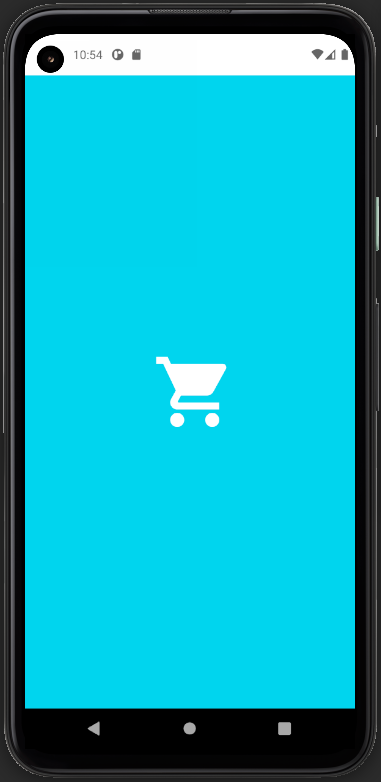
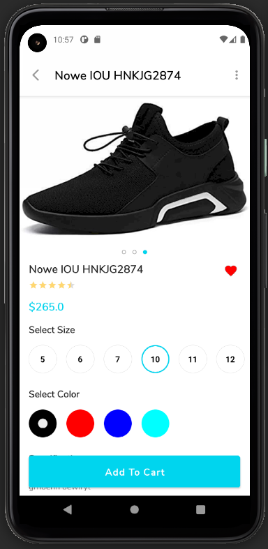
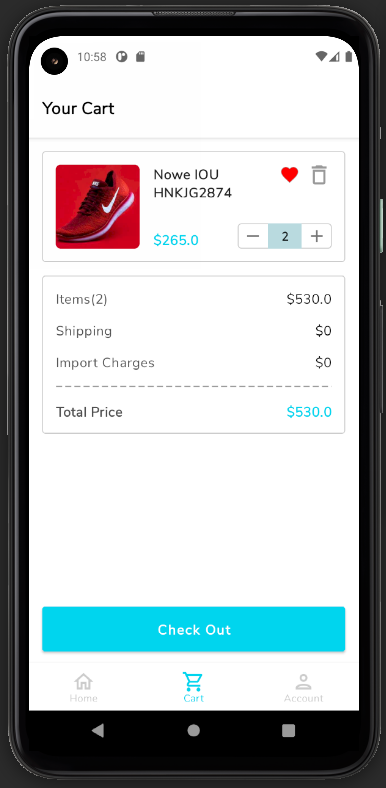
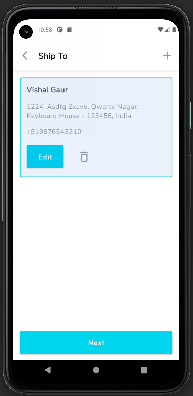
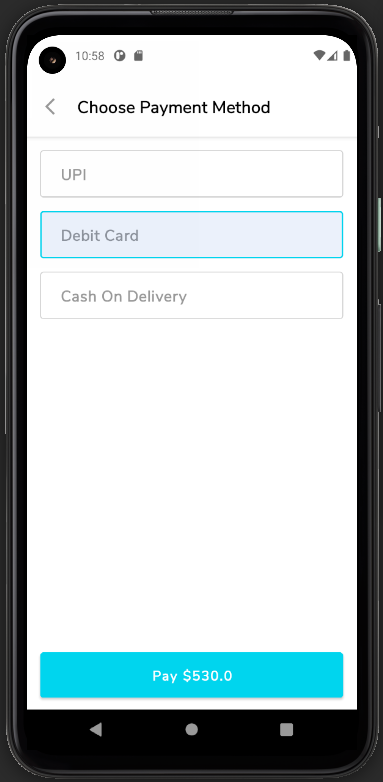
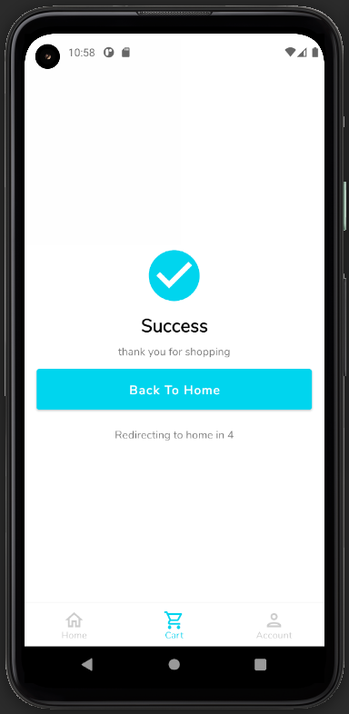
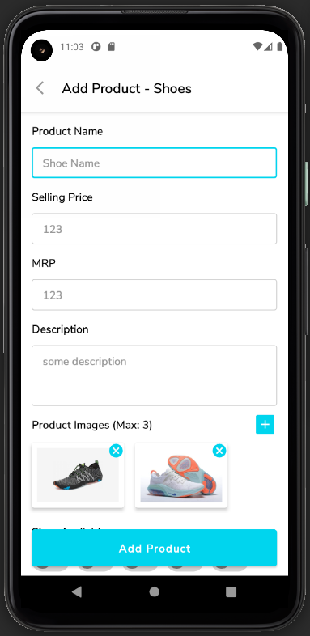
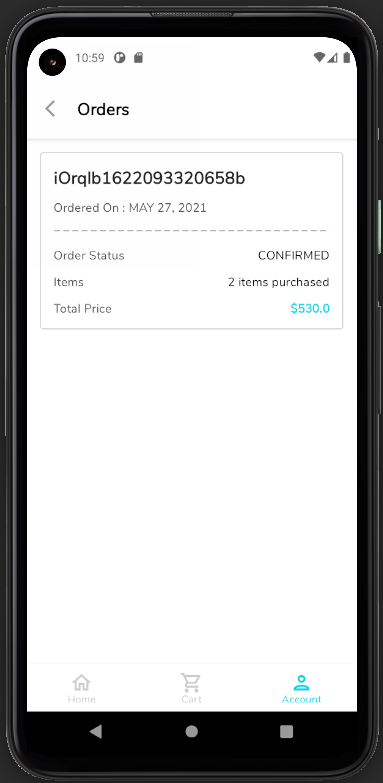
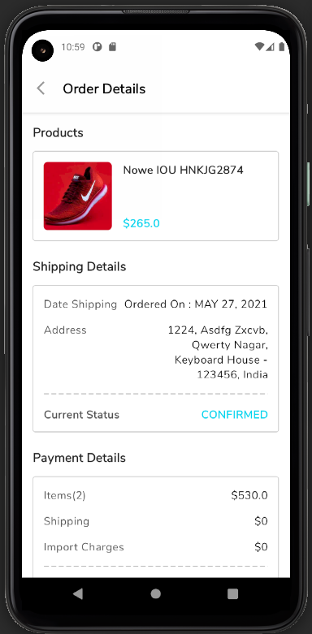
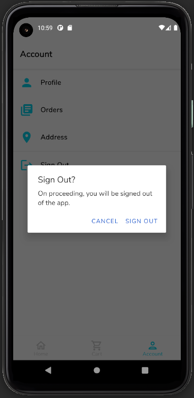

# Shopping Android App
An e-commerce android application written in Kotlin where users can sell and buy products. 


## Overview
The application contains list of products such as shoes, slippers on which user can click to view its details and then, add them to cart. User can like and dislike the product as well. Also, User can sell products, if he/she signed up as a Seller.
Some other features are as following:
- Login / Signup with OTP Verification.
- Recyclerview with variable span size to show products.
- Search Bar and filtering
- Product detail screen with image carousel and custom Radio Buttons.
- Add/Edit Product for Sellers
- See all orders placed.
- Increase/Decrease quantity of product in cart.
- Place Order.
- Modify status of order for Seller.
- Add/Edit Address
- Tested using Espresso. Written unit, instrumentation and UI tests.

## Some Screenshots

|             Splash Screen            |             Application Home              |           Product Detail            |
| :----------------------------------: | :---------------------------------------: | :----------------------------------:|
|  |  |  |

|                 Signup              |                Login              |        OTP Verification         |
| :---------------------------------: | :-------------------------------: | :------------------------------:|
|  |  |  |

|           Shopping Cart          |             Address Selection              |             Payment Method             |               Order Success               |
| :------------------------------: | :----------------------------------------: | :-------------------------------------:| :---------------------------------------: |
|  |  |  |  |

|               Add Product               |             All Orders             |                Order Detail              |               Sign Out               |
| :-------------------------------------: | :--------------------------------: | :---------------------------------------:| :----------------------------------: |
|  |  |  |  |

## Project Setup

### Clone and install

Clone this repository and import into Android Studio
```
git clone https://github.com/i-vishi/shopping-android-app.git
```

### Configuration
- The project requires Firebase. So follow the steps given [here (Add Firebase to Android Project)](https://firebase.google.com/docs/android/setup) to add firebase to your android project.
- Download the firebase config file `google-services.json`
- Move the config file to module directory `(app)` of the project.

## Built With
- Kotlin
- Firebase
- Room
- Material
- Glide


---

<p align="center"> Made with :blue_heart: by <a href="https://github.com/i-vishi">Vishal Gaur</a></p>
